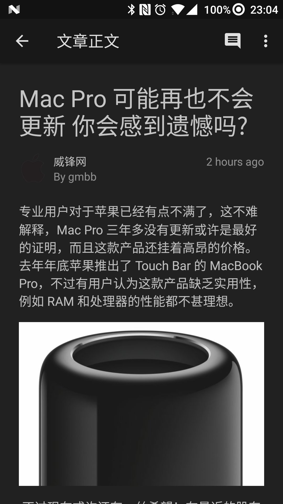

# FxcnBeta

目前市场中的 cnBeta 官方客户端及其他第三方客户端的设计风格大体上未能向 Material Design 靠拢，于是就有了这个项目。

<a href='https://play.google.com/store/apps/details?id=org.chaos.fx.cnbeta&pcampaignid=MKT-Other-global-all-co-prtnr-py-PartBadge-Mar2515-1'></a>

<a href='http://www.coolapk.com/apk/org.chaos.fx.cnbeta'></a>

## 预览图

**日间模式**
<p>

</p>

**夜间模式**
<p>

</p>

## release 配置

在本地 `local.properties` 中添加下列配置

```
WECHAT_APPID=
KEY_ALIAS=
KEY_PASSWORD=
STORE_FILE=
STORE_PASSWORD=
```

## Thanks

* 应用图标设计师 __By__ (Thinkoffuture@gmail.com)

## 开源库 

* [SwipeBackLayout](https://github.com/ikew0ng/SwipeBackLayout)
* [PhotoView](https://github.com/chrisbanes/PhotoView)
* [MaterialProgressBar](https://github.com/DreaminginCodeZH/MaterialProgressBar)
* [BottomBar](https://github.com/roughike/BottomBar)
* [Butter Knife](http://jakewharton.github.io/butterknife)
* [OkHttp](http://square.github.io/okhttp)
* [Picasso](http://square.github.io/picasso)
* [Retrofit](https://square.github.io/retrofit/)
* [RxJava](https://github.com/ReactiveX/RxJava)
* [RxAndroid](https://github.com/ReactiveX/RxAndroid)
* [Gson](https://github.com/google/gson)
* [jsoup](https://jsoup.org/)
* [LicensesDialog](https://github.com/PSDev/LicensesDialog)
* [GreenDao](http://greenrobot.org/greendao/)
* [BaseRecyclerViewAdapterHelper](https://github.com/CymChad/BaseRecyclerViewAdapterHelper)

## License


    Copyright 2015-2017 Chaos

    Licensed under the Apache License, Version 2.0 (the "License");
    you may not use this file except in compliance with the License.
    You may obtain a copy of the License at

        http://www.apache.org/licenses/LICENSE-2.0

    Unless required by applicable law or agreed to in writing, software
    distributed under the License is distributed on an "AS IS" BASIS,
    WITHOUT WARRANTIES OR CONDITIONS OF ANY KIND, either express or implied.
    See the License for the specific language governing permissions and
    limitations under the License.

